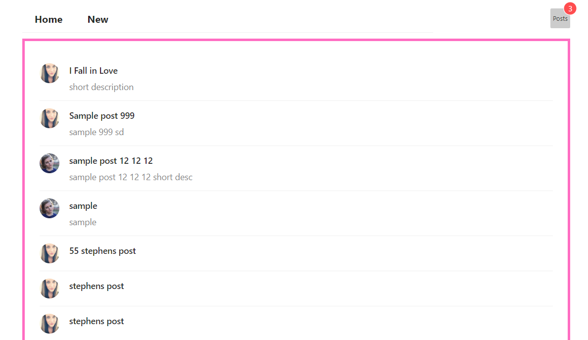
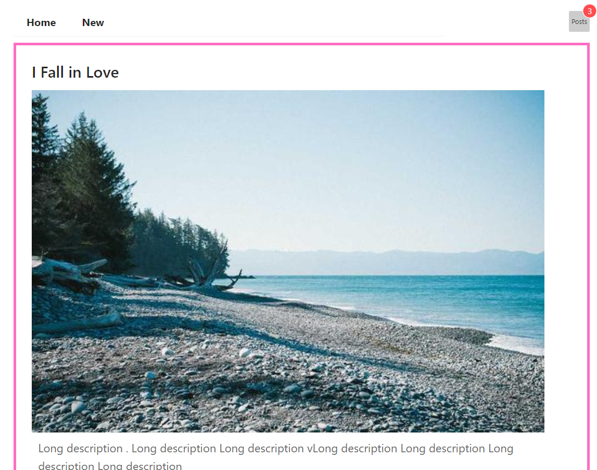
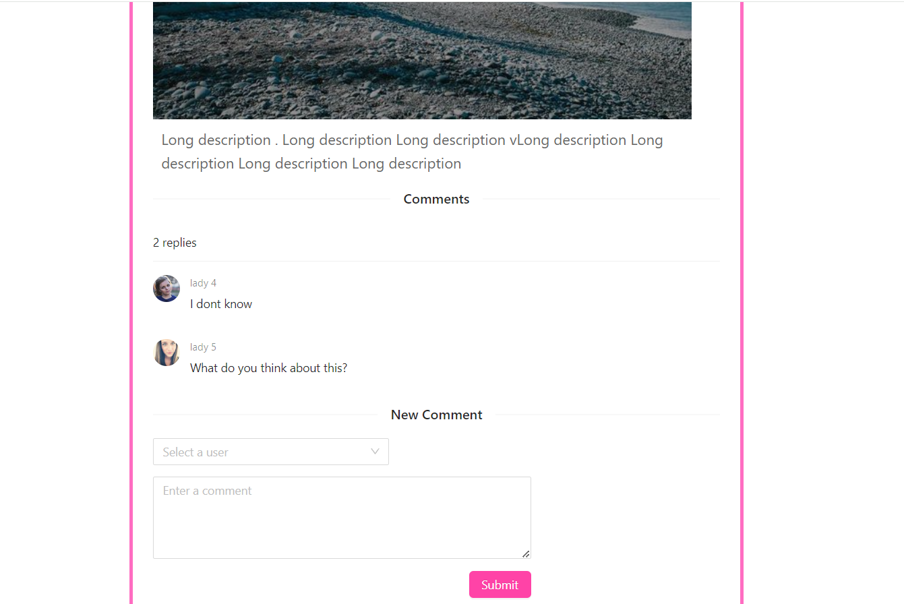

# GraphQL Comments App with Hasura :star:

This project assignment has been prepared for the 'Kodluyoruz' GraphQL course. Add, delete, update mutations, subscriptions with hasura, graphql, apollo. 

---

---

